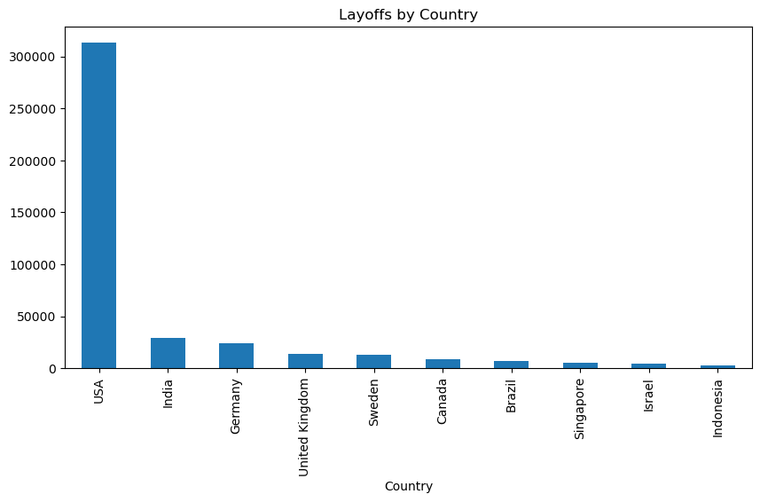
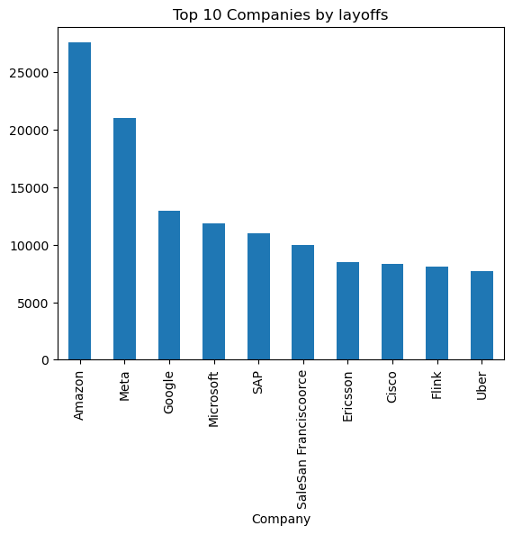
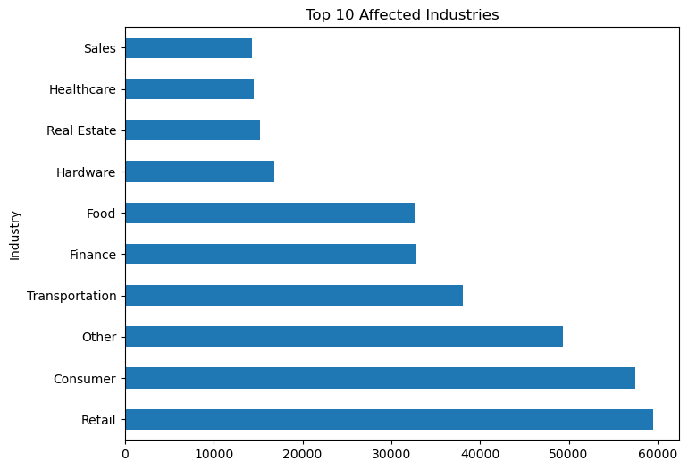

# Tech Layoffs EDA (Exploratory Data Analysis)

• This project explores global tech layoffs using real-world data to uncover patterns by year, company, industry, funding stage, geography, and more.

## Objectives

• Understand layoffs across years, months, and quarters  
• Identify affected countries, industries, and companies  
• Analyze company sizes and funding stages before layoffs  
• Visualize key trends with clear, insightful graphs

## Key Insights

• Top companies with layoffs: Amazon, Meta, and Google  
• Industries hit hardest: Retail, consumer  
• Most layoffs occurred in Q1 2023, followed closely by Q4 2022  
• USA and India saw the highest layoffs  
• The majority of layoffs occurred in late-stage companies, especially those in the Post-IPO, Series D, Series E, and Private Equity stages  
• January had the highest total layoffs, followed by November and March across all years in the dataset

## Tools Used

• Python (Pandas, Matplotlib, Seaborn)  
• Jupyter Notebook  
• Git & GitHub

## What I Learned

• Real-world data cleaning (nulls, whitespace, outliers)  
• Date-time feature engineering  
• Writing clean, reusable analysis code  
• Crafting clear visual insights for business storytelling

## Conclusion

• This project provided valuable insights into global layoff trends, allowing me to apply essential data analysis skills such as data cleaning, visualization, and interpretation. By examining patterns across industries, locations, and timeframes, I gained a deeper understanding of economic and business shifts that impact employment. It also strengthened my ability to work with real-world datasets and communicate findings effectively.

## 📊 Visualizations

### 1. Layoffs by Country

### 2. Layoffs by Company

### 3. Affected Industries

